# Analysis of JAVA development's current situation


The project is from *Computer System Design and Applications A* course in SUSTech in 2022 spring semester.

| teammates    | work                                           |
| ------------ | ---------------------------------------------- |
| Ruihao Zhang | front and back end, data mining, data analysis |
| Xiangbo Deng | back end, redis                                |


### Overview

- [Outline](#Outline)
- [Project Structure](#project-structure)
- [Project Features](#project-features)
- [Data Preparation](#data-preparation)
- [Showcase](#showcase)
- [Insights](#insights)
- [Conclusion](#conclusion)


### Start

1. run back end ( Spring Boot and Redis)

   Spring Boot: `src/main/java/com/sustech/cs209a_project/Cs209AProjectApplication.java`

2. run front end

   ```shell
   cd vue-admin-template/
   npm run dev # need to install dependencies first
   ```

   

## Outline

Java is one of the most popular languages around the world and up to now, there are countless developers involved in the construction of  Java and leveraging it to implement various projects. However, today’s popularity doesn't guarantee the popularity of the future and it is necessary to analyse  Java’s current situation. We will analyse it from three aspects:

- Popularity among all languages in recent years
- Usage of Java
- Vitality of community

Finally, we will give developers suggestions according to our analysis.


## Project Structure

### Technology Stack

- Back end: Springboot, Redis
- Front end: Vue, Echarts


### Architecture Design

- Back end

  - Utils Package
    - provide some utils for script or server
    - PublicUtils.java
    - RedisUtil.java
    - JsonIO.java
    - TimeUtils.java

  - pojo Package
    - provide some java class for json parse or data transmission

  - config Package
    - set the configuration of Redis

  - controller Package
    - manager the api of the server

  - service Package
    - realize the interface of the service

  - script Package
    - collect and analyze the data from GitHub, and store them to the file

  - resources/rawdata
    - collected data from GitHub by script

  - resources/ripedata
    - the analyzed data by script

- Front end

  The front end uses a **[template](https://github.com/PanJiaChen/vue-element-admin)** from [**Panjiachen**](https://github.com/PanJiaChen) and we modify it to adjust to our demand.


## Project Features

### Login

Users can login to the system via GitHub. The system will use the user’s GitHub access token to do the online searching, which will be limited without an access token.

### Offline Searching

We collect some data and analysis them, storing the data in the JSON file. If a user requests this data, the system will read the data from the file and send it to the browser.

### Online Searching

The system provides a function that users can analyze a GitHub repository online by providing the URL of the repository. Because of the limitation of GitHub, users should provide their GitHub access token to do the online searching. The system will search via GitHub RESTFUL API, and analyze the collected data, then send it to the client.

### Cache

Online searching is so slow, so we design a cache system via Redis to improve the performance.

When a user does an online search, the system will store the request and response as  a key-value in the Redis. The key-value will be stored for ten minutes, and after that, the record will be destroyed.

If another user does an online search that is already stored in the Redis, the system will be sent the result to the client directly, and reset the destroyed time to ten minutes.

### Visualization

We use Echarts to establish what we collect and what we analyze. Different types of charts such as line chart, pie chart, word cloud and  punch card of GitHub are used, which can give us more insights. With Panjiachen's template, we succeeded in organizing these charts in order so that users can have a better experience.


## Data Preparation

> Data source: Github
> 

### Data collection & persistence

We collect data by our automated Java codes which invoke Github’s APIs We store our data as json and they are put into a certain directory. Our  automated codes and data are in following directories:

- Codes: `src/main/java/com/sustech/cs209a_project/script/collectors`
- Resources: `src/main/resources/rawdata`

We firstly use API

```jsx
https://api.github.com/search/repositories
```

to collect **5w** repositories with over 10 stars and store them in json. Therefore, we can directly analyse repositories’ features.

Apart from above API, we call others for different parts of our topics:

| topics | Example API |
| --- | --- |
| Popularity among all languages in recent years | 1. https://api.github.com/search/repositories?sort=stars&q=language:C+stars:>1000&per_page=3&page=1 |
| Usage of Java | 1. https://api.github.com/search/repositories?sort=stars&q=language:java |
| Vitality of community  | 1.  https://api.github.com/repos/Snailclimb/JavaGuide/contributors
2.  https://api.github.com/repos/Snailclimb/JavaGuide/issues |

We use **Gson** and **fastjson** to read and write data in json. Codes like [JsonIO.java](http://JsonIO.java) is for this functions.

> e.g  [JsonIO.java](http://JsonIO.java) in src/main/java/com/sustech/cs209a_project/utils
> 


## Showcase

- Page 1

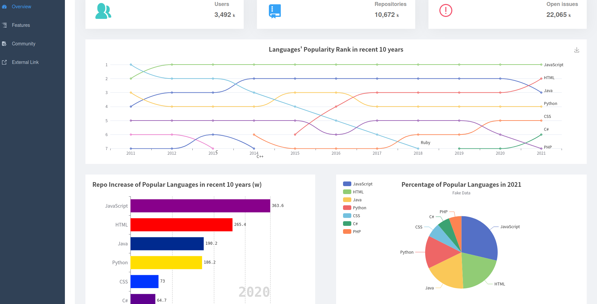

- Page 2

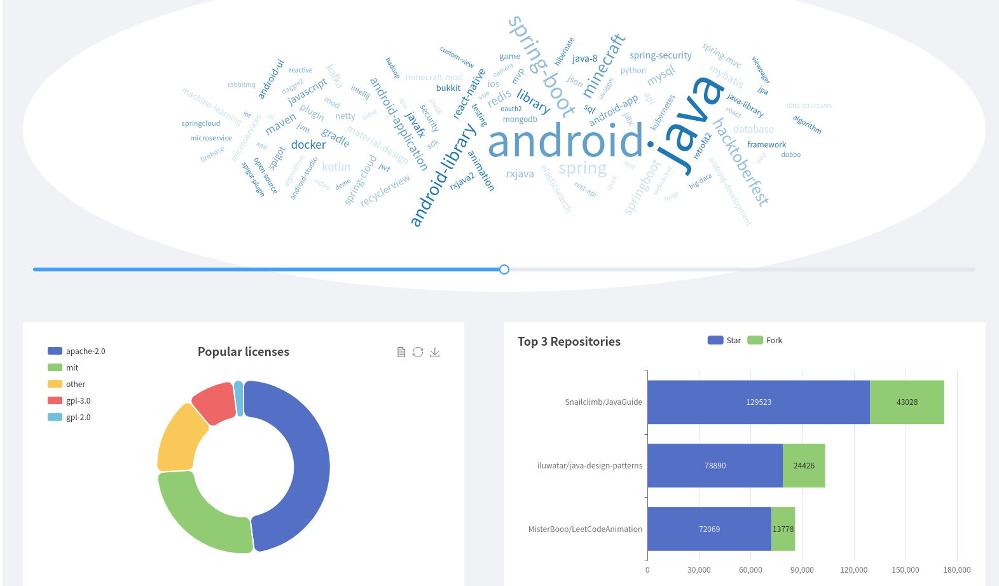

- Page 3 (searching)

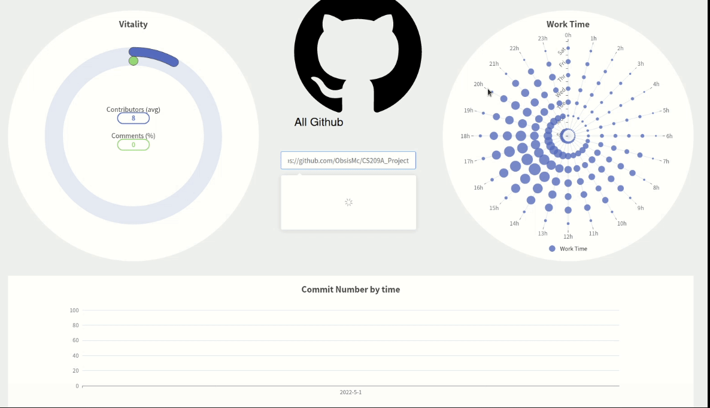

## Insights

We get insights from our three parts

### Popularity among all languages in recent years

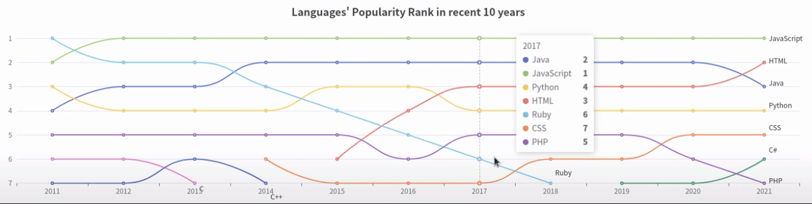

In recent years, Java is always in the top three position which means Java is still very popular in the world.


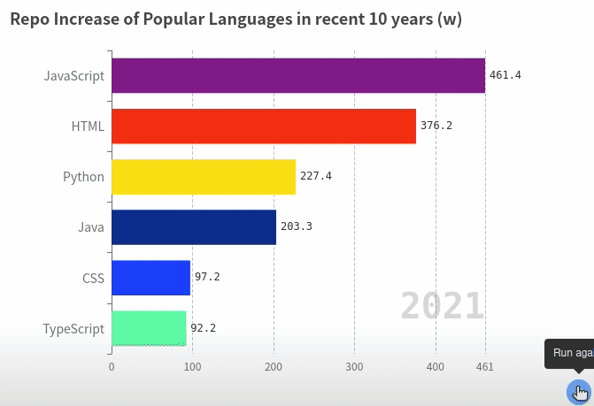

However, according to increase rank, we find that Java’s increase becomes slower than before and python and other languages begin to catch up with Java which means Java may become less popular.


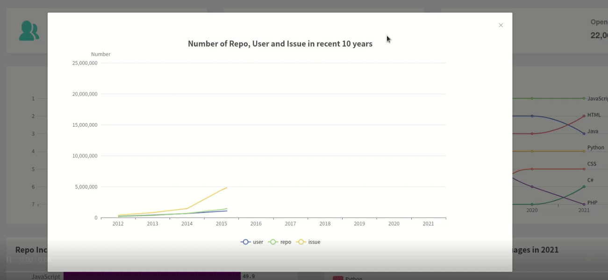

Plus, in recent years,  average number of repositories and issues per user become larger than before which means Java developers become more active and they are willing to do more projects.


### Usage of Java

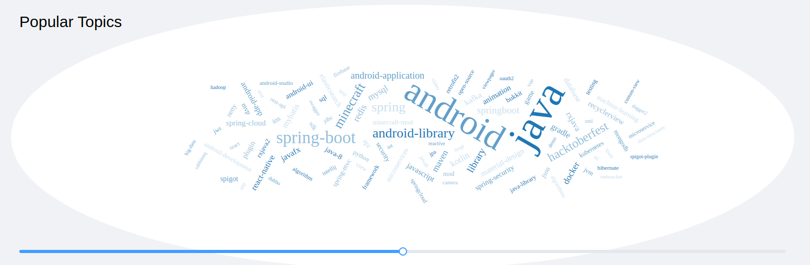

From word cloud, we find that android and spring-boot are most popular topic in Java. Therefore, maybe Web and android are where Java can take full use of itself.

 

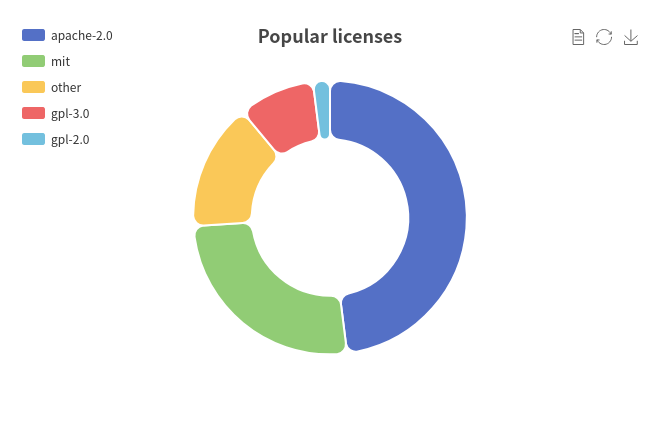

According to popular license, we can know apache-2.0 is the most popular license so if you have no idea which license to use, you can use it.


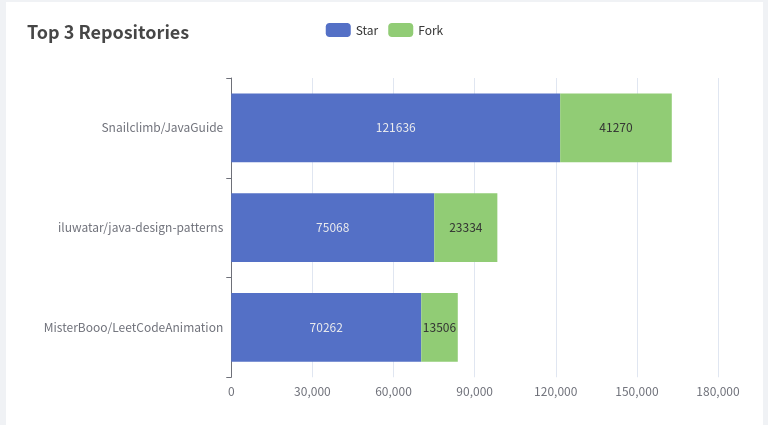

Top 3 repositories are all about interview and are created by Chinese. We can see that maybe for Chinese, tutorials for programming languages are the most popular.

 

### Vitality of community

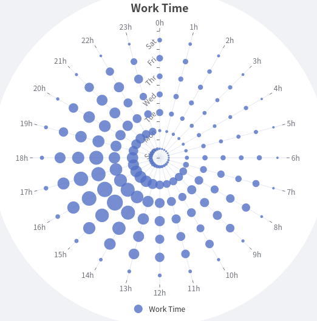

From the graph, we can know Wednesday is the day when people are likely to work. Therefore, developers can try to contact others on Wednesday in Github in order to get rapid responses. 

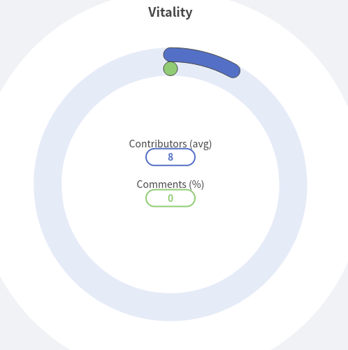

Average contributors per repository is about 8. We can see that developers are very active to contribute their codes. 

## Conclusion

All in all, Java is still very popular in recent years. However, in the future, maybe Java will become less popular and other languages like python may catch up with it. Although the increase becomes slow, Java developers’ vitality may improves since average number of repositories per user become lager. To maintain its position, Java needs to focus on its advantages like android and web. Plus, job interview gets most attentions from developers, especially Chinese developers.

For developers, if you want to learn web and android, maybe Java is your first choice. If you want to get rapid  response, maybe you can contact developers on Wednesday.