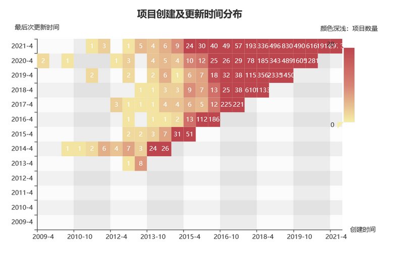
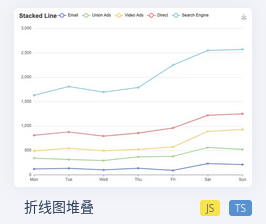
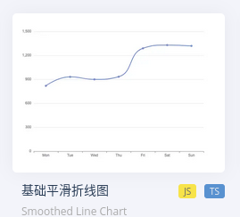
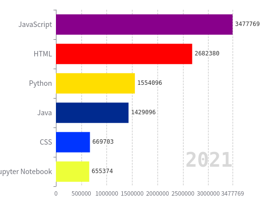
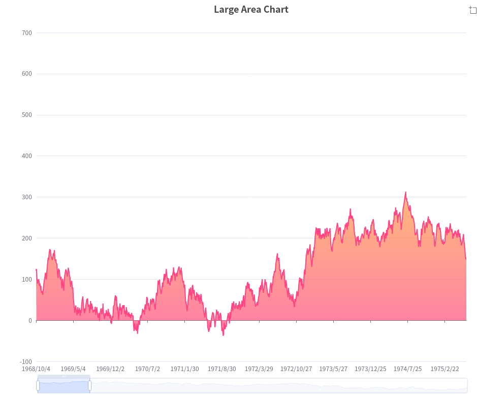
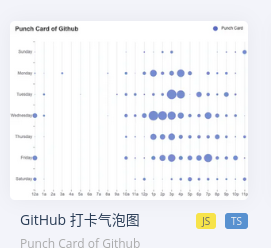

# CS209A_Project

## Topic A

1. 各个国家java代码质量

    1.

2. 各国家java使用人数

    1. 通过项目查找人的国家
    2. 统计人数

3. 地区活跃度

    - 人的最后更新时间

4. 组织影响力

5. java时间尺度的流行度和频率趋势

    1. 项目创建及更新时间
    2. 项目数量

   

6. Github Repos Total Stars in Time

    - star数量时间变化

## Topic B

> pay attention, search API may don't give out the entire results

JAVA发展趋势分析:

> 1. analyse the language itself
> 2. analyse its community which stands for vitality of a language

> targets: JAVA developers

1. Total trending

    1. 流行度 (how many people use it):
        - repos的数量，总数或者只看增长速率 ( in recent years)
        - advanced: use stars, forks and more metrics (average stars or else) to evaluate the popularity
    2. 和哪些语言配合比较多:
        - star最多的前20%（or fixed number）的repo中, which languages does JAVA coopereate with.
    3. what are hot topics and fields:
        - use description of repos to analyse frequency of words
    4. license
    5. relation of the number of contributors, issue, pr, stars, size

   > Goal: give users a picture about how popular Java is nowadays and give developers some suggestions about what they should learn to catch up with the development of JAVA

2. community situation:

> haven't come up with detail solutions, followings are just conceptions
1. commit number by time
2. activity:
   1. author
      1. issues' tags number
      2. issue time span
      3. average comments of pr
      4. release number
   2. contributor
      1. number of contributor
   3. both
      1. average comments of issue
3. habits of users involved in JAVA repos
    1. what's the work time for them during a day (or a week)
4. 

> Goal: manifest vigour of JAVA, and also give JAVA developers advice on how and when to communicate with other JAVA developers.

## Tools

### API

github API: https://docs.github.com/cn/rest

### Third Libraries

Echarts: https://echarts.apache.org/zh/index.html

### Reference

analysis 1: https://www.benfrederickson.com/github-developer-locations/

github official report: https://baijiahao.baidu.com/s?id=1716745477182306006&wfr=spider&for=pc

### Others

star时间

```
Accept: application/vnd.github.v3+json
https://api.github.com/repos/OWNER/REPO/stargazers
```

### Records

#### Repos

| star             | num    |
| ---------------- | ------ |
| 10<x<100         | 87000+ |
| 100<x<1000       | 17000+ |
| 1000<x<10000     | 2700+  |
| 10000<x<100000   | 170+   |
| 100000<x<1000000 | 1      |

| star          | num          |
| ------------- |--------------|
| 10:40         | 68000+; +1   |
| 40:70         | 13000+: +5   |
| 70:100        | 6300+: +10   |
| 100:200       | 8000+: +10   |
| 200:400       | 3000+: +50   |
| 400:1000      | 4000~: +100  |
| 1000:2000     | 1000+; +1000 |
| 2000:7000     | 1000+; +5000 |
| 7000:10000    | 115; +3000   |
| 10000:1000000 | 100+         |

should have data: 39k(30+6+3) + 20k(10+4+6) + 1k + 1k +1k + 172
> what a troublesome task. Every search can only get at most 1000 results because of github's limit and in order to 
> get more than 50k data, I need to split the entire search into sporadic searches.

## Task
1. java ranks

   1. total number rank
   
      
> format: [{ name: str , type: "line" stack: "Total", smooth: true, data: [] },{...},...]
   2. 

2. word cloud

   description

3. ladar graph：

   > stand for  活跃度（可能fork, pull...的极差 or else）
   
4. when do users likely to work

5. a repo 兴衰： commit数 by time

> data format: {date:[t0,t1,..,tn], data:[N0,N1,...,Nn]} 


> format: {hours:[...], days:[...], data:[[],[],...]} --> 
> hours (str): X axis; days (str): Y axis; data: [x, y, n], there are n commits at (x, y)

1. Bonus:
   1. user login
   2. user choose repo and crawl data on the air. 
   3. show contributors locations