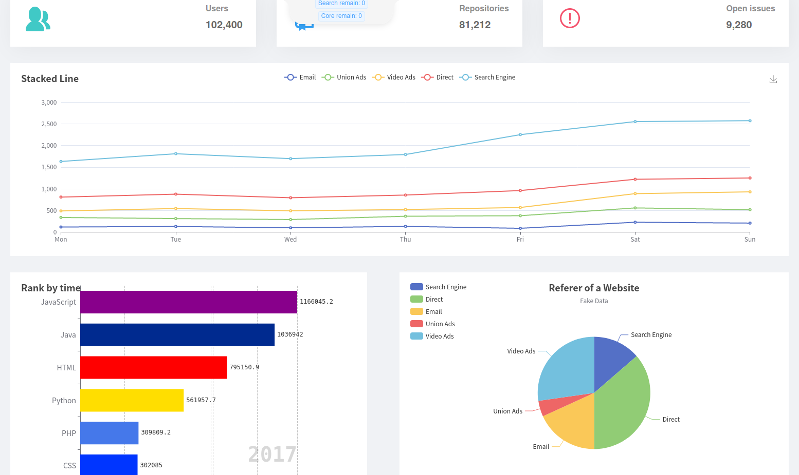
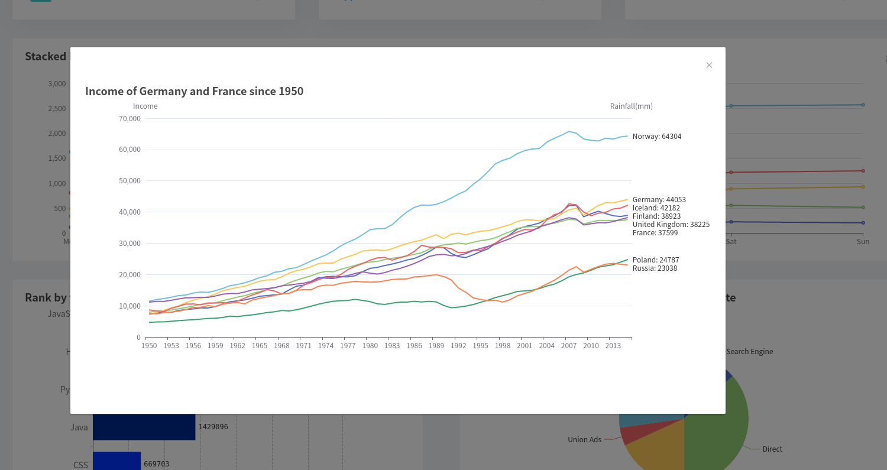
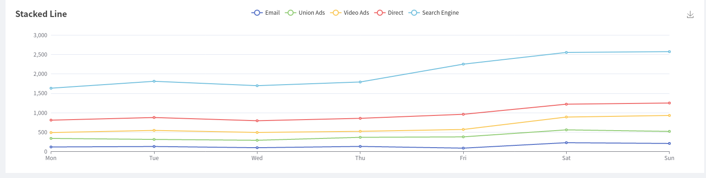
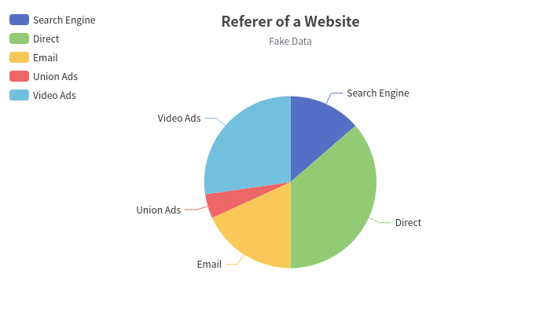
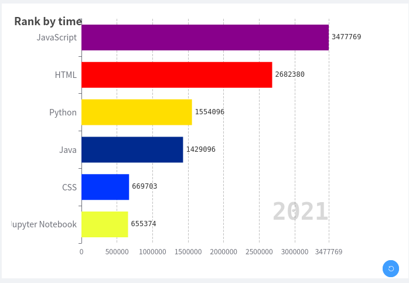
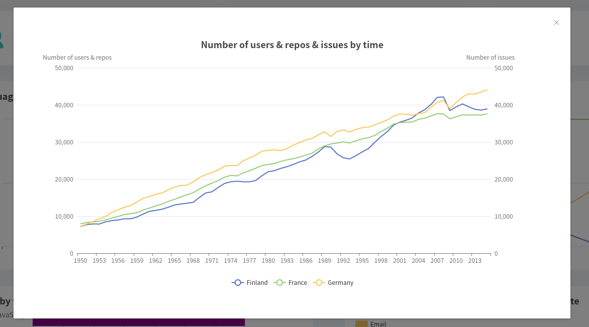
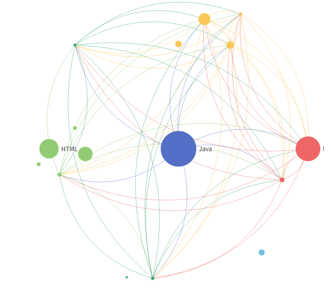
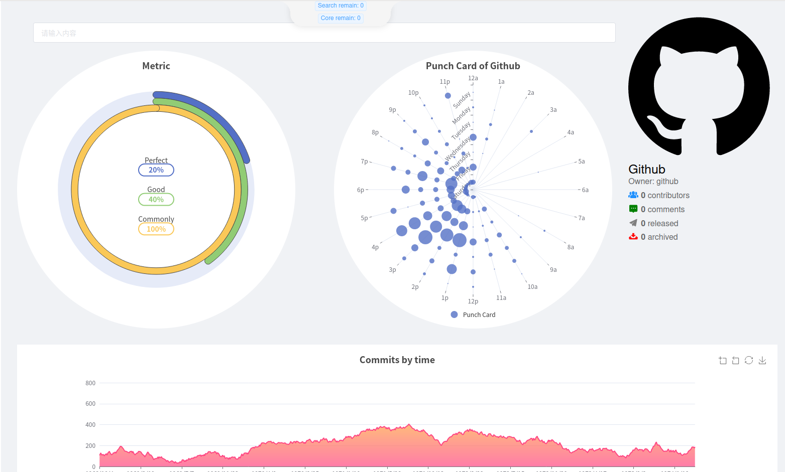
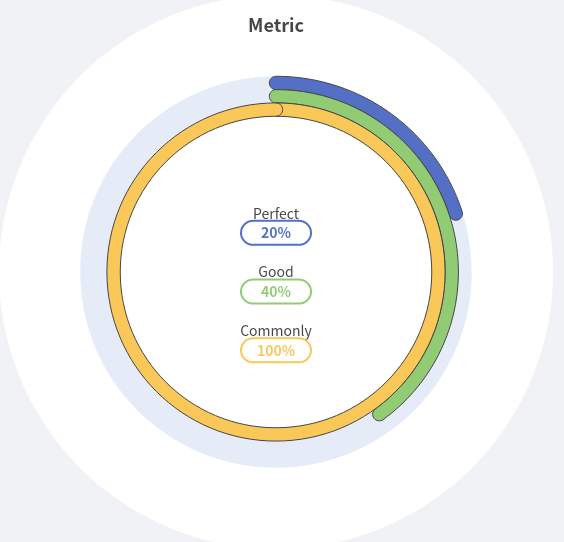
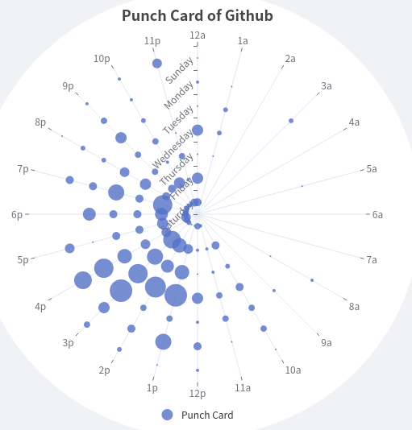

# Data Format
## Part 1

> 这一页都是用已经爬好的数据


 and 


#### :star: Corresponding data

###### LanguageTotalRepoByTime.json

> LanguageTotalIssueByTime.json and LanguageTotalUserByTime.json are in the same format

```json
{
    2007: [ // a year's data
        {
            count: 10, // current year's increasement
            name: "Java", // lanuage's name
            value: 10 // accumulated number up to current year
        }
    ],
    2008: [
        {
            count: 12,
            name: "Java",
            value: 22
        }
    ]
}
```

### Graph

#### Stacked Line



展示每一年前7的语言排名，y轴是排名从上到下数字越大，最上面数字为1；x轴是年份，展示2012～2021年

> 用总仓库数来排名，LanguageTotalRepoByTime.json 里面的value

```json
{
  name: [
    'Java',
    'C',
    'C++',
    'Python',
    ...
  ],
  // 要改成所有的语言名
  "dataset": [
    ["name","rank","year"],
    ['Java',1,2015],
    ['Java',1,2016],
    ...,
    ["Python",2,2015],
    ...
  ] // 第一行是表头，第一列对应java名，第二列是排名（不在前7的话留空就行），第三列年份；对于同一个语言需要按时间排序（年份小的放前面）
}
```
#### Pie graph at right-bottom corner



和上一个图是对应的，当鼠标移动到上一个图的x轴某一点，该饼图会展示对应年份前7的语言的总仓库数

```json
{
    "2007": [ // 每一年只要前7的语言
        {value: 1048, name: 'Search Engine'}, // name 是语言名， value是该年的该语言的总仓库数
        {value: 735, name: 'Direct'},
        {value: 580, name: 'Email'},
        {value: 484, name: 'Union Ads'},
        {value: 300, name: 'Video Ads'}
    ],
    "2008": [
        {value: 1048, name: 'Search Engine'},
        {value: 735, name: 'Direct'},
        {value: 580, name: 'Email'},
        {value: 484, name: 'Union Ads'},
        {value: 300, name: 'Video Ads'}
    ]
}
```


#### Rank by time



动态展示每一年不同热门语言仓库数量增量

> 用LanguageTotalRepoByTime.json 的 count

```json
[
    {
        language:[
            "Java",
            "C"
        ],
        nums:[
            126967, // 用LanguageTotalRepoByTime.json 的count
            10000
        ],
        year: 2012
    },
    {
        language:[
            "Java",
            "C"
        ],
        nums:[
            126967,
            10000
        ],
        year: 2013
    }
]
```

#### 最后一个图



```json
{
  name: ["users", "repos", "issues"],
  // 要改成所有的语言名
  "dataset": [
    ["name","value","year"],
    ['users',10000,2015],
    ['users',12000,2016],
    ...,
    ["issues",1200000,2015],
    ...
  ] // 第一行是表头，第一列对应java名，第二列是排名（不在前7的话留空就行），第三列年份；对于同一个语言需要按时间排序（年份小的放前面）
}
```


## Part 2



```json
// 用jsonTotalWithLanguage.json里面的"lanugages"，"languages"里面的值可能表示行数，值比较大，可能要处理一下（我之前是算百分比）
{
    "nodes":[ // 就是图上的球
        {
            "id":0,
            "name":"Java"，
           	"value":100.44
        },
        {
            "id":1,
            "name":"HTML",
            "value":10.23
        },
        ...
    ],
    "links":[ // 线，这里的边是有向边，但两个节点间最多一个线就行了不然太乱
        {
        	"source": 0,
        	"target": 1
        },
		...
    ]
}
```

**只留value最大的前15个语言 as nodes！**

## Part 3


### Left 



展示该仓库的贡献者数量，issue的平均评论数，pr的平均评论数

```js
// value: (you know)
// name: should be "Contributors", "Issue comments (avg)", "PR comments (avg)"
[
  {
    value: 20,
    name: 'Perfect'
  },
  {
    value: 40,
    name: 'Good'
  },
  {
    value: 100,
    name: 'Commonly'
  }
]
```

#### Right

 or    

展示程序猿都喜欢在什么时间工作（就是commit时间）

```js
// hours: x axis, string
// days: y axis
// data: [x, y, value], [0, 0, 5] means ('12a', 'Saturday')'s value is 5
{
    hours: [
        '12a', '1a', '2a', '3a', '4a', '5a', '6a',
        '7a', '8a', '9a', '10a', '11a',
        '12p', '1p', '2p', '3p', '4p', '5p',
        '6p', '7p', '8p', '9p', '10p', '11p'
	],
	days: [
        'Sat', 'Fri', 'Thu',
        'Wed', 'Tus', 'Mon', 'Sun'
	],
	data: [[0, 0, 5], [0, 1, 1], [0, 2, 0], [0, 3, 0]]
}
```

